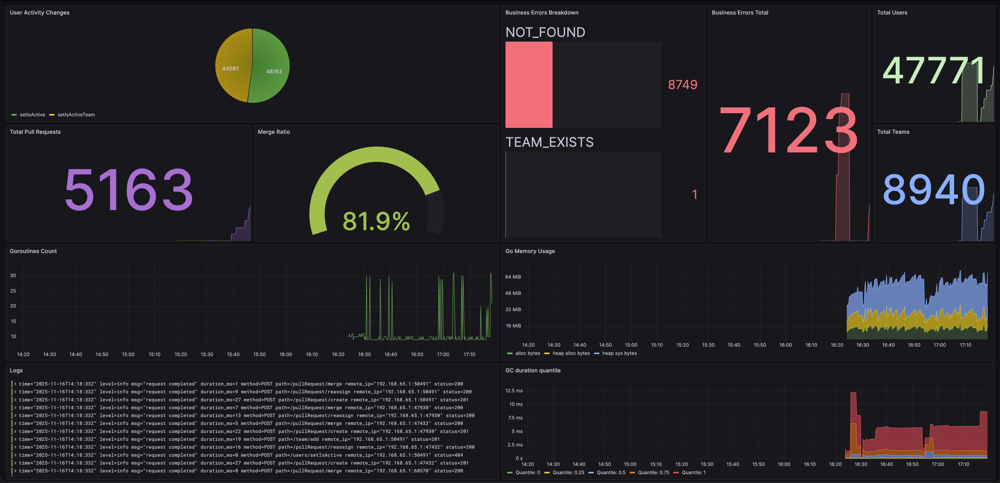

# Pull Request Assigner


Микросервис для автоматизации работы с Pull Request'ами, управления командам и активностями участников.

## Архитектура сервиса

Сервис построен по принципам **Clean Architecture** и разделен на несколько слоев логики обработки сообщений:

* **CMD** - Точка входа в проект.
* **Config** - Конфигурационные данные для проекта в формате `.yaml`.
* **Docs** - Автоматически сгенерированная при помощи `swaggo/swag` документация.
* **Internal** - Необходимые пакеты для внутренней работы сервиса:
  * **App** - Сбор зависимостей проекта и инициализация структур.
  * **Config** - Обработка данных из конфигурационных файлов и секретов.
  * **Controller** - Работа с серверами проекта.
    * **HTTP/v1** - Первая версия текущего API: роутер, аутентификация, обработка ошибок.
  * **Metrics** - Инициализация глобальных `Prometheus`-метрик.
  * **Models** - Структуры сущностей, используемых в проекте.
  * **Repo** - Бизнес-логика работы с базой данных.
  * **Service** - Обработка входных параметров и работа с репозиториями.
* **Migrations** - Файлы миграций к базе данных.
* **PKG** - Экспортируемые в другие проекты решения, реализации сервера и базы данных, логгер и валидатор

Сервис корректно запускается и предоставляет `Graceful Shutdown` для корректного завершения работы. Кроме того в проекте также присутствует конфигурация дэшбордов и сервисов сбора данных и метрик.

## Схема данных

### Users

   | Поле      | Формат  | Описание                                   |
   | --------- | ------- | ------------------------------------------ |
   | id        | SERIAL  | Уникальный идентификатор                   |
   | user_id   | TEXT    | Идентификатор внешней системы (по условию) |
   | username  | TEXT    | Отображаемое имя                           |
   | team_name | TEXT    | Название команды                           |
   | is_active | BOOLEAN | Флаг активности                            |

### Teams

   | Поле      | Формат  | Описание                                   |
   | --------- | ------- | ------------------------------------------ |
   | id        | SERIAL  | Уникальный идентификатор                   |
   | team_name | TEXT    | Название команды                           |

### Pull Requests

   | Поле                 | Формат    | Описание                                    |
   | -------------------- | --------- | ------------------------------------------- |
   | id                   | SERIAL    | Уникальный идентификатор                    |
   | pull_request_id      | TEXT      | Идентификатор внешней системы (по условию)  |
   | pull_request_name    | TEXT      | Название                                    |
   | author_id            | TEXT      | Внешний идентификатор автора                |
   | status               | TEXT      | Статус (`OPEN`/`MERGED`)                    |
   | needs_more_reviewers | BOOLEAN   | Флаг необходимости дополнительных ревьюэров |
   | created_at           | TIMESTAMP | Дата создания                               |
   | merged_at            | TIMESTAMP | Дата merge'а                                |

## Использованые технологии

* **Go 1.21+**
* **chi/v5**- удобная работа с роутами
* **go-playground/validator** - валидация структур запросов
* **PostgreSQL** - основная база данных
* **Swagger** - документация API
* **golang-migrate/migrate** - миграции базы данных
* **pgx + squirrel** - работа с запросами PostgreSQL
* **Viper** - скрейп конфигов
* **Docker + docker-compose** - поднятие окружения и деплой
* **golangci-lint** - статический анализ кода
* **k6** - нагрузочное и интеграционное тестирование
* **Grafana + Grafana Loki** - отрисовка дэшбордов и логов
* **Prometheus + Promtail** - сбор и хранение метрик

## Запуск проекта

### Требования

1. Docker && docker-compose
1. Make

### Настройка

1. Создать `.env`-файл в корне проекта, скопировав содержимое из `.env.example`
1. Поднять сервис: (миграции применяются автоматически; команды для ручного поднятия лежат в Makefile)

```zsh
make compose-up
```

Теперь сервис на [http://localhost:8080](http://localhost:8080) (если отсутствует переопределение стандартного порта через файл конфигурации)

## API документация

* *Swagger*: [http://localhost:8080/swagger/index.html](http://localhost:8080/swagger/index.html)
* Все эндпоинты работают через **HTTP API** и авторизуются с помощью заголовка `X-Api-Key`

## Примеры запросов

### Создание команды

```zsh
curl -X POST 'http://localhost:8080/team/add' \
-H 'Content-Type: application/json' \
-H 'X-Api-Key: <ADMIN_API_KEY>' \
-d '{
  "team_name": "team_1",
  "members": [
    {"user_id": "u1", "username": "Alice", "is_active": true},
    {"user_id": "u2", "username": "Bob", "is_active": true}
  ]
}'
```

### Merge Pull Request'а

```zsh
curl -X POST 'http://localhost:8080/pullRequest/merge' \
-H 'Content-Type: application/json' \
-H 'X-Api-Key: <ADMIN_API_KEY>' \
-d '{"pull_request_id": "pr1"}'
```

### Деактивация команды

```zsh
curl -X POST 'http://localhost:8080/users/deactivateTeam' \
-H 'Content-Type: application/json' \
-H 'X-Api-Key: <ADMIN_API_KEY>' \
-d '{
  "team_name": "team_1"
}'
```

**\*** **Подробная документация ко всем необходимым запросам размещена в Swagger**

## Тестирование

### Интеграционное + нагрузочное тестирование

* Файлы `tests/k6/*.js`
* Пример запуска:

```zsh
# Перезапуск сервера, тест, выключение сервера
make test

# Запуск тестов без запуска и выключения контейнеров
make test-no-compose
```

## Отчет по нагрузочному тестированию

Нагрузочное тестирование проводилось при помощи [k6](https://k6.io/). Было проведено тестирование на 4-ех сценариях: `smoke`, `team_tests`, `user_tests`, `pr_tests`. Все проверки были успешно пройдены: **0% ошибок**.

* **Smoke test**- `smoke.js`, наиболее полный сценарий использования
  * **Одна** итерация
  * **8** проверок *(каждый бизнес-эндпоинт по одному разу)*
  * **HTTP**: среднее время ответа *~13.48ms*, максимальное: *~41ms*
  * **Результат**: все эндпоинты отвечают корректно, время ответа низкое
* **Team test**- `team_tests.js`, нагрузочное тестирование эндпоинов комманд
  * **10** VU, **15s** Duration
  * **1580** итераций (*~105 i/s*)
  * **4740** проверок
  * **4740/4740 (100%)** успешных проверок
  * **HTTP**: среднее время ответа *~31.57ms*, максимальное: *~172.6ms*, 90-ый перцентиль *~38.3ms*
  * **Результат**: стабильная работа API при 10 параллельных пользователях
* **User test**- `user_tests.js`, нагрузочное тестирование эндпоинов юзеров
  * **10** VU, **15s** Duration
  * **12077** итераций (*~804.6 i/s*)
  * **24154** проверок
  * **24154/24154 (100%)** успешных проверок
  * **HTTP**: среднее время ответа *~6.14ms*, максимальное: *~194.95ms*, 90-ый перцентиль *~9.01ms*
  * **Результат**: операции выполняются быстро и стабильно при высокой нагрузке
* **Pull Request test**- `pr_tests.js`, нагрузочное тестирование эндпоинов юзеров
  * **5** VU, **15s** Duration
  * **1032** итераций (*~68.6 i/s*)
  * **3096** проверок
  * **3096/3096 (100%)** успешных проверок
  * **HTTP**: среднее время ответа *~18.1ms*, максимальное: *~97.6ms*, 90-ый перцентиль *~33ms*
  * **Результат**: логика работы с Pull Request'ами выдерживает высокую нагрузку и быстро предоставляет ответ

### Общая оценка нагрузочного тестирования

* **Ошибки**- *0%*
* **Скорость обработки**- *6-32ms* в среднем, максимум *~172ms*
* **Стабильность**- система выдерживает 5-10 VU при большой нагрузке, итерации успешно завершаются

**Вывод**: сервис корректно работет под нагрузкой, эндпоинты функционируют в рамках заданного **SLA** *( <300ms)*

## Метрики и дэшборд

В качестве решения дополнительного задания с метриками был создан ***Grafana***-дэшборд.



### Начало использования

1. Запустить сервис *(см. выше)*.
1. Открыть в браузере *Chrome* вкладку [http://localhost:3000](http://localhost:3000).
1. Ввести стандартный логин и пароль для начальной настройки:
  **login: `admin`, password: `admin`**
  В будущем эти данные будут постоянными для входа.
1. Настроить локальные данные для входа.
1. Перейти во вкладку *Dashboards* *(см. выпадающее меню в левой части)*.
1. Перейти в автоматически импортированный **Business Dashboard**.

### Отчет по заданиям

1. Конфигурация запросов полностью совпадает с предоставленной (расхождения- см. ниже).
1. Сервис уверенно выдерживает требуемые объемы запросов.
1. Пользователь с `isActive = false` не назначается на ревью.
1. Операция merge идемпотентна.
1. Сервис и его зависимости поднимаются командой `docker-compose up` на `localhost:8080` (если вручную не сменить порт в `.env`).

#### Дополнительные задания

1. Эндпоинт статистики- `/metrics`. Отрисовка и обработка метрик- [Grafana-дэшборд](http://localhost:3000).
1. Нагрузочное тестирование проведено, результаты прикреплены (см. выше).
1. Метод массовой деактивации пользователей команды реализован (`POST /team/deactivate`. Подробное описание эндпоинта также есть в **Swagger**); операция переназначения открытых PR обернута транзакцию и откатывается полностью при ошибке на любом этапе, а также спокойно укладывается в лимит *100ms*.
1. Интеграционное тестирование реализовано и совмещено с нагрузочным (пример интеграционного теста- `smoke.js`, нагрузочного- остальные тесты).
1. Конфигурация линтера описана и находится в корне проекта.

## Вопросы по решению

1. **Поле needsMoreReviewers у пулл реквестов не используется.**
**Принятое решение:** добавить поле в базу данных и обновлять его по необходимости, но при этом не выводить: при создании пулл реквеста его значение задается исходя из количества автоматически назначенных ревьюэров: если меньше двух- `TRUE`, в противном случае- `FALSE`. При мердже пулл реквеста значение поля меняется на `FALSE` (ревьюэры не нужны для уже замердженного пулл реквеста).
1. **При установке положительного флага активности для юзера, может ли он оставаться ревьюэром?**
**Принятое решение:** да, может. Исходя из формулировки описание эндпоинта в спецификации openapi (`summary: Установить флаг активности пользователя`), данный эндпоинт является техническим и не имеет логической силы: грубо говоря он действительно может сделать ревьюэра пулл-реквеста активным, сохранив за ним текущий статус ревьюэра.
1. **Присутствует ли авторизация и аутентификация?**
**Принятое решение:** так авторизация не упомянута в условии, но при этом на некоторых роутах присутствует аутентификация по юзер- или админ-ключу, сделана заглушка, проверяющая заранее сгенерированные токены, хранящиеся в секретах и передающиеся в заголовке `X-Api-Key`.
1. **Каков механизм поиска нового юзера в рамках команды для переназначения ревьюэра на пулл-реквест?**
**Принятое решение:** брать первого попавшегося свободного юзера.
1. **При создании команды можно ли обновить username пользователя?**
**Принятое решение:** будем считать, что обновить можно оба поля: и название команды, и имя пользователя. Хоть это и не логично, но таким образом мы подпадаем под все правила из `openapi.yml`, не вводя новый тип ошибки и делая результат запроса более очевидным, нежели бы мы просто игнорировали имя пользователя, переданное в запросе
1. **Поле mergedAt в успешном ответе на pull_request/merge нарушает правила нейминга полей (camelCase вместо snake_case).**
**Принятое решение:** оставить поле с таким форматом во избежание поломки автоматической системы проверки при ее наличии.
1. **Неточности в распределении разрешений на вызов роутов: просматривать команды может только админ, а создавать новые может кто угодно.** **Принятое решение:** оставить как есть по той же причине, что в вышеописанном вопросе.
1. **Какой формат для вывода метрик в дополнительном задании?**
**Принятое решение:** подключить и настроитьPrometheus и Grafana
